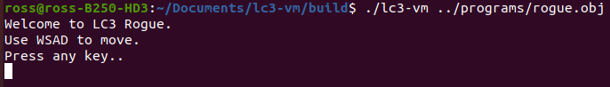
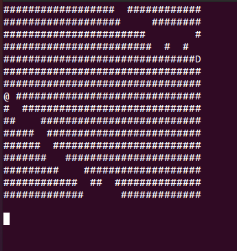

# lc3-vm

I created this project to brush up on my binary arithmetic and low-level programming skills. All credit to the tutorial goes to https://justinmeiners.github.io/lc3-vm. I decided to structure my code slightly differently and make it compatible with both windows and unix. 

# About

This VM simulates the LC-3, a simplified version of the x86 architecture which contains fewer instructions. It uses an array of 16-bit integers to simulate the 11 registers used in the LC-3. The main memory is simulated with an array of 65,536 16-bit integers, each of which corresponds to a single memory slot. 

# Screenshots





# Installation
Create a build directory and navigate to it. Then build/compile the code. Here's what it looks like on linux/mac:
```
$ git clone https://github.com/ross-m/lc3-vm
$ mkdir build
$ cd build
$ cmake ..
$ cmake --build .
```

# Usage

I've included several programs in the ```programs``` directory to demonstrate the functionality of my VM. To run one of these, issue the following commands:
```
$ cd build
$ ./lc3-vm ../programs/xxx.obj
```
